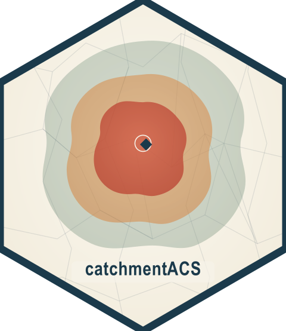

# catchmentACS 

[](https://github.com/joonho112/catchmentACS/actions/workflows/R-CMD-check.yaml)
[](https://github.com/joonho112/catchmentACS/actions/workflows/regression.yml)
[](https://github.com/joonho112/catchmentACS/actions/workflows/test-coverage.yaml)
[](https://lifecycle.r-lib.org/articles/stages.html#beta)
[](LICENSE)

**Who lives within a 10-minute drive of this Pre-K site, and how does that
neighborhood differ from one 15 minutes out?**

`catchmentACS` answers questions like this for early-childhood program siting
and equity analysis. You give it a few program locations; it draws drive-time
*catchments* around each one and reports the American Community Survey (ACS)
conditions inside them — poverty, SNAP receipt, SSI, unemployment, labor-force
participation, and more — each with a propagated margin of error and a full
provenance trail you can audit.

It is built for the applied researcher or analyst who needs defensible
neighborhood estimates without hand-assembling a GIS-plus-Census pipeline. One
call, `cacs_run()`, takes site points, a state, an ACS year, drive-time bands,
and a routing provider, and returns catchment-level ACS estimates,
area-weighted margins of error, and curated rate indicators.

## Installation

```r
# Install from GitHub (pre-CRAN)
# install.packages("pak")
pak::pak("joonho112/catchmentACS")

# Install from CRAN, if available
# install.packages("catchmentACS")
```

A Census API key is needed **only** when a live ACS pull is required — that is,
on a cache miss or when `force_refresh = TRUE`. Cache hits and runs that supply
data through `acs =` work without a key.

```r
tidycensus::census_api_key("YOUR_KEY_HERE", install = TRUE)
```

OSRM is the default routing provider. OpenRouteService (ORS) is also implemented
for live runs via the optional `openrouteservice` package and an API key passed
through `ors_api_key` or `ORS_API_KEY`.

## 30-Second Offline Example

This example is fully self-contained and runs with no network access. It uses
bundled fixtures — synthetic sites and ACS inputs plus synthetic buffered-circle
isochrones carrying OSRM-style provenance metadata — and passes them through
`precomputed_isochrones =` and `acs =`. It does **not** call Census, OSRM, ORS,
or any other live service, so it is copy-paste runnable offline.

```r
library(catchmentACS)
library(dplyr)
library(sf)

cacs_set_cache(FALSE, scope = "session")
options(
  catchmentACS.progress = "off",
  catchmentACS.rate_first_default = FALSE
)

sites <- readRDS(system.file(
  "extdata", "legacy_2025_sites.rds", package = "catchmentACS"
))
iso <- readRDS(system.file(
  "extdata", "legacy_2025_isochrones.rds", package = "catchmentACS"
))
acs <- readRDS(system.file(
  "extdata", "sample_alabama_subset.rds", package = "catchmentACS"
))

site_id <- "AL_SITE_03"

result <- cacs_run(
  sites = sites[sites$site_id == site_id, , drop = FALSE],
  state = "AL",
  year = 2023,
  drive_times = c(5, 10, 15),
  variables = unname(cacs_acs_default_vars),
  provider = "osrm",
  precomputed_isochrones = iso[iso$site_id == site_id, , drop = FALSE],
  acs = acs,
  weight_method = "area",
  output = "long",
  verbose = FALSE
)

stopifnot(attr(result, "cacs_run_provenance")$execution_path == "3-call")

tibble::as_tibble(result, rate_first = FALSE) |>
  filter(variable %in% names(cacs_acs_default_rates)) |>
  select(site_id, drive_time_min, variable, estimate, moe, failure_origin)
```

You get one row per `(drive-time band, rate)`, each with an `estimate` and its
`moe`. Reading down a single site, you can watch poverty, SNAP, and labor-force
rates shift as the catchment widens from 5 to 15 minutes — exactly the equity
gradient that site-selection decisions hinge on.

These fixtures are realistic package-check and demo inputs, **not** live
analytical truth for Alabama reporting. For a live analysis, drop
`precomputed_isochrones =` and `acs =`, supply a Census API key if ACS is not
already warm in the cache, and choose a routing provider that matches your
environment. The `provider = "osrm"` value above records provenance from the
frozen isochrone fixture; it does not make a live OSRM request.

## What Works in v0.5

**Implemented**

- Area-weighted tract aggregation (the supported weighting method in this release).
- ACS5 tract pulls for one state at a time, release-verified for 2009–2024.
- OSRM and ORS isochrone providers (ORS requires `ors_api_key` or `ORS_API_KEY`).
- Five curated rate indicators — poverty, SNAP, SSI, unemployment, and
  labor-force participation — with margin-of-error (MOE) propagation.
- Cache, validation, summary, and leaflet helper surfaces.

**Deferred (reserved fail-loud surfaces)**

- Mapbox and r5r routing providers.
- Population weighting.
- Custom rate catalogues and arbitrary formula parsing.
- ACS1, block-group, county, and vectorized multi-state ACS pulls.

Deferred features are not silent placeholders: requesting them stops the run
with a clear, classed error rather than returning a misleading result.

## Documentation

The package ships a layered set of articles, organized into three tracks. Start
with **Applied** for the hands-on workflow, dip into **Method** when you need
the math behind an estimate, and consult **Migration** when upgrading across
versions. Each links to its rendered pkgdown page; you can also open any of them
locally with `vignette("name", package = "catchmentACS")`.

### Applied Researchers Track

| Article | Description |
|---------|-------------|
| [Getting started](https://joonho112.github.io/catchmentACS/articles/getting-started.html) | Your first catchment in a few minutes, end to end, written for non-daily R users. |
| [Alabama Pre-K tutorial](https://joonho112.github.io/catchmentACS/articles/alabama-tutorial.html) | A full Pre-K catchment analysis, from the raw pipeline to publication-ready reporting tables. |
| [Providers, credentials, and offline paths](https://joonho112.github.io/catchmentACS/articles/providers.html) | Which services are implemented, what keys they need, and how to stay no-network. |
| [Visual walkthrough](https://joonho112.github.io/catchmentACS/articles/visual-walkthrough.html) | The pipeline one site at a time, with leaflet maps at each stage. |

### Methodological Researchers Track

| Article | Description |
|---------|-------------|
| [Methodology](https://joonho112.github.io/catchmentACS/articles/methodology.html) | The pipeline framed as a single area-weighted estimator, with its assumptions. |
| [Spatial aggregation](https://joonho112.github.io/catchmentACS/articles/theory-spatial-aggregation.html) | Area-weighted estimation over tract–isochrone intersections. |
| [MOE propagation](https://joonho112.github.io/catchmentACS/articles/theory-moe-propagation.html) | How Census margins of error combine across aggregated tracts. |
| [Derived rates](https://joonho112.github.io/catchmentACS/articles/theory-derived-rates.html) | The five rate definitions and their ratio margins of error. |

### Migration Track

| Article | Description |
|---------|-------------|
| [Porting to v0.3](https://joonho112.github.io/catchmentACS/articles/porting-v01-to-v03.html) | Moving v0.1 / v0.2 workflows onto the v0.3 topology, cache, and rate formulas. |
| [Porting to v0.4](https://joonho112.github.io/catchmentACS/articles/porting-v03-to-v04.html) | The four adoption-readiness changes from v0.3 to v0.4. |
| [Porting to v0.5](https://joonho112.github.io/catchmentACS/articles/porting-v04-to-v05.html) | Beta-readiness changes from v0.4 to v0.5: provider/weighting status, ACS preflight, and the fixture contract. |

Function-level help is available for the core verbs: `?cacs_run`,
`?cacs_isochrone`, and `?cacs_intersect_weight`.

## Citation

If you use catchmentACS in your research, please cite it. Run
`citation("catchmentACS")` for the version-specific entry, or use:

```bibtex
@Manual{catchmentACS,
  title  = {{catchmentACS}: Isochrone-Based Area-Weighted {ACS} Aggregation},
  author = {JoonHo Lee},
  year   = {2026},
  note   = {R package version 0.5.0},
  url    = {https://github.com/joonho112/catchmentACS},
}
```

JoonHo Lee ([ORCID: 0009-0006-4019-8703](https://orcid.org/0009-0006-4019-8703)).

## License

MIT © [JoonHo Lee](https://github.com/joonho112)

## Bug Reports

Bug reports and feature requests are welcome at
<https://github.com/joonho112/catchmentACS/issues>.
