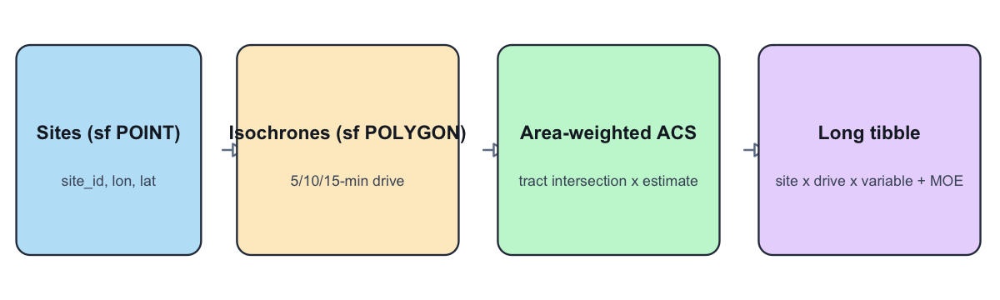

```{r}
#| label: setup
#| eval: true

library(catchmentACS)
library(dplyr)
library(sf)

# Force network-free, deterministic builds: no provider/Census calls, no cache.
old_options <- options(
  catchmentACS.progress = "off",
  catchmentACS.rate_first_default = FALSE
)
old_cache <- getOption("catchmentACS.cache_enabled", NULL)
on.exit(options(old_options), add = TRUE)
on.exit(options(catchmentACS.cache_enabled = old_cache), add = TRUE)
cacs_set_cache(FALSE, scope = "session")
```

This is your ten-minute first run. It is written for people new to the package,
including Pre-K administrators and policy researchers who do not work in R every
day. By the end you will have run one function, read the table it returns, and
(optionally) drawn one map.

If you are porting an older v0.1 or v0.2 script, start instead with the
checklist in `vignette("porting-v01-to-v03", package = "catchmentACS")`.

::: {.callout-note}
## About the data in this article

The tables and map here are built entirely from the package's bundled
`inst/extdata` fixtures (the synthetic `legacy_2025_*` and
`sample_alabama_subset` objects), so this article renders with **no** Census,
OSRM, ORS, or other network calls. These fixtures are **synthetic and
illustrative** — included only for examples, tests, and reproducible package
checks. They are **not** live Alabama policy estimates and must not be cited as
real ACS results. Any real analysis requires a fresh live run (see
`vignette("providers", package = "catchmentACS")`).
:::

## What catchmentACS does

You give it a set of program sites and a few drive times (say 5, 10, and 15
minutes). For each site, `catchmentACS` draws the area you can reach within each
drive time, finds the census tracts that fall inside, and reports the American
Community Survey (ACS) conditions there — poverty, SNAP, employment, and more —
each with a margin of error. In one sentence: *it answers "what are neighborhood
conditions within a short drive of this site?"*

The whole pipeline runs in a single call, `cacs_run()`:

> **sites + drive times** → drive-time areas → census tracts inside →
> area-weighted ACS totals and rates (with margins of error) → one tidy table.

The math behind the area weighting and the margins of error lives in
`vignette("methodology", package = "catchmentACS")`; this article stays at the
workflow level.



## Install

Once the package is on CRAN:

```r
install.packages("catchmentACS")
```

Before then, install from GitHub:

```r
# install.packages("pak")
pak::pak("joonho112/catchmentACS")
```

A live run that pulls fresh ACS data needs a free Census API key (one-time
setup, takes a minute at <https://api.census.gov/data/key_signup.html>):

```r
tidycensus::census_api_key("YOUR_KEY_HERE", install = TRUE)
```

You do **not** need a key for this article — it uses bundled data — and the
default routing provider (OSRM) needs no key either, so you can follow along
with nothing installed beyond the package itself.

## Your first run (offline)

The example below is the whole package in one call, and it runs fully offline.
It loads three bundled fixtures — sites, precomputed drive-time areas, and an
ACS extract — and passes the last two through `precomputed_isochrones =` and
`acs =`. Those two arguments tell `cacs_run()` to **skip** the routing and
Census downloads and use what you hand it, so this makes no network calls and
needs no API key. We use one site, `AL_SITE_03`, with drive times of 5, 10, and
15 minutes. **You can copy and run this as-is.**

```{r}
#| label: first-run-offline
#| eval: true

# Load the three bundled example inputs.
sites <- readRDS(system.file(
  "extdata", "legacy_2025_sites.rds", package = "catchmentACS"
))
iso <- readRDS(system.file(
  "extdata", "legacy_2025_isochrones.rds", package = "catchmentACS"
))
acs <- readRDS(system.file(
  "extdata", "sample_alabama_subset.rds", package = "catchmentACS"
))

site_id <- "AL_SITE_03"

result <- cacs_run(
  sites                  = sites[sites$site_id == site_id, , drop = FALSE],
  state                  = "AL",
  year                   = 2023,
  drive_times            = c(5, 10, 15),
  variables              = unname(cacs_acs_default_vars),
  provider               = "osrm",
  precomputed_isochrones = iso[iso$site_id == site_id, , drop = FALSE],
  acs                    = acs,
  weight_method          = "area",
  output                 = "long",
  verbose                = FALSE
)

dim(result)
```

A quick look at the arguments:

- `sites` — your program locations (here, one synthetic site).
- `state` / `year` — the ACS universe: a two-letter state code and the *end
  year* of the 5-year ACS (2009–2024 supported; 2024 is the most recent vintage).
- `drive_times` — the catchment bands in minutes (here, three nested rings).
- `variables` — which ACS variables to pull; `cacs_acs_default_vars` is the
  built-in default set.
- `provider` — the routing engine for live runs. Here `"osrm"` only labels the
  provenance of the precomputed areas; it makes no request.
- `precomputed_isochrones` / `acs` — the offline bypass: supply both and no
  network is touched. Drop both for a real run.
- `weight_method` — `"area"` is the supported method in this release.
- `output` — the shape of the result (`"long"`, `"list_column"`, or `"both"`).

**What you would run for real.** Once your Census key is set, a live run is the
same call without the two bypass arguments — `catchmentACS` then draws the
drive-time areas with OSRM and pulls ACS data for you. That form is shown here
but not executed (it would need a network):

```{r}
#| label: first-run-live
#| eval: false

# Live form: needs a Census key and network access.
tidycensus::census_api_key("YOUR_KEY_HERE", install = TRUE)

result <- cacs_run(
  sites       = cacs_alabama_sites,   # 10 bundled Alabama sites, or your own
  state       = "AL",
  year        = 2023,
  drive_times = c(5, 10, 15),
  provider    = "osrm",
  output      = "long"
)
```

See `?cacs_run` for every argument, and
`vignette("alabama-tutorial", package = "catchmentACS")` for the same offline
call worked into a reporting-ready table.

## Reading your results

`result` is one tidy *long* table: one row per site, drive-time band, and
variable. It carries extra bookkeeping columns that record how, when, and from
what data each number was made — useful when you share results, ignorable
otherwise. Day to day you read only a handful:

```{r}
#| label: read-result
#| eval: true

result |>
  filter(variable %in% names(cacs_acs_default_rates)) |>
  select(site_id, drive_time_min, variable, estimate, moe, failure_origin) |>
  head(10)
```

| Column           | Plain-English meaning                                         |
|------------------|---------------------------------------------------------------|
| `site_id`        | Which program site this row describes.                        |
| `drive_time_min` | Which catchment band, in minutes (5, 10, or 15).              |
| `variable`       | Which indicator (e.g. `poverty_rate`, or a raw ACS code).     |
| `estimate`       | The value. For a rate, a proportion: `0.173` means 17.3%.     |
| `moe`            | Margin of error (MOE) at the 90% level — see below.           |
| `failure_origin` | `"none"` means the row is good; otherwise where it went wrong.|

A **margin of error (MOE)** is the half-width of a 90% confidence interval: you
report a value as `estimate ± moe`, the same way the Census Bureau reports ACS
figures. So a `poverty_rate` of `0.173` with an `moe` of `0.024` says the
catchment's poverty rate is about 17.3% ± 2.4 points. The package carries the
ACS published MOEs through every weighting and rate step; the formulas are in
`?cacs_propagate_moe` and `vignette("methodology", package = "catchmentACS")`.

Two habits worth forming early:

- **Check `failure_origin` first.** `failure_origin == "none"` is your success
  flag. If an estimate is `NA`, this column names the stage that produced the
  gap (an upstream ACS input, an isochrone failure, an empty intersection, and
  so on) so you can diagnose rather than guess.
- **The five curated rates ride alongside the raw variables.** Every
  `(site, drive_time)` cell gets five extra rows — `poverty_rate`, `snap_rate`,
  `ssi_rate`, `unemp_rate`, and `labor_force_participation` — computed from the
  raw ACS counts. They share the same `estimate`/`moe` columns, so you read them
  exactly like any other variable. These are the headline outputs most users
  reach for.

Here are the five curated rates for the 15-minute catchment around this site:

```{r}
#| label: rates-15min
#| eval: true

result |>
  filter(
    variable %in% names(cacs_acs_default_rates),
    drive_time_min == 15,
    failure_origin == "none"
  ) |>
  select(site_id, drive_time_min, variable, estimate, moe)
```

For a friendlier view, `summary()` reshapes the same numbers into one row per
site and drive time, with each rate formatted as `estimate ± MOE`:

```{r}
#| label: summary-rates
#| eval: true

summary(result)$rates_per_site_moe
```

Remember these numbers come from synthetic example data; cite real values only
from a live run.

## An optional map

If the optional `leaflet` package is installed, you can see the site and its
15-minute drive-time area on a base map. This chunk is gated on the namespace,
so it is simply skipped when `leaflet` is absent — and we call `leaflet::`
rather than attaching the package.

```{r}
#| label: example-map
#| eval: !expr requireNamespace("leaflet", quietly = TRUE)

one_site_pt  <- sites[sites$site_id == site_id, ]
one_site_iso <- iso[iso$site_id == site_id & iso$drive_time_min == 15, ]

leaflet::leaflet(one_site_pt) |>
  leaflet::addProviderTiles("CartoDB.Positron") |>
  leaflet::addPolygons(
    data = one_site_iso, weight = 2, opacity = 0.6,
    color = "#c05621", fillOpacity = 0.15
  ) |>
  leaflet::addCircleMarkers(
    radius = 5, color = "#2b6cb0",
    fillOpacity = 0.8, stroke = FALSE,
    popup = ~site_id
  )
```

The blue dot is the site; the orange shape is everything within a 15-minute
drive. Change the `site_id` value near the top of "Your first run" to explore a
different site.

## Where to next

You have your first estimate. From here:

- **A full reporting workflow** on real Alabama sites — comparing sites, building
  export tables: `vignette("alabama-tutorial", package = "catchmentACS")`.
- **Routing providers and credentials** — OSRM (default), ORS (optional, needs a
  key), and the reserved Mapbox/r5r surfaces:
  `vignette("providers", package = "catchmentACS")`.
- **The math behind area weighting and MOE propagation**:
  `vignette("methodology", package = "catchmentACS")`.
- **Every `cacs_run()` argument in detail**: `?cacs_run`.

Bug reports and feature requests:
<https://github.com/joonho112/catchmentACS/issues>.
